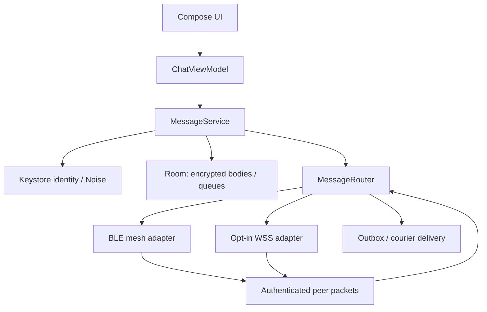

# Architecture

## Ownership

`MainActivity` owns Android activity-result pickers, mesh permission requests, bounded media capture and temporary playback. It does not implement routing or Bluetooth. `ChatViewModel` coordinates UI commands and Flow state. `MessageService` owns cryptographic message preparation, persistence, receipts, public cache, peer pins, retries and courier allocations. `MeshService` provides explicit foreground networking and adapter state handling.

`MessageRouter` consumes transport capabilities and signed packets. Its sink requests scheduled relay jitter and application delivery. `BleMeshTransport` owns radio permissions, advertiser, scanner, central/peripheral GATT callbacks and serialized operation queues. `InternetTransport` owns configured secure WebSocket links and reconnection policy. Protocol/routing classes are free of Android and Room dependencies.

## Message lifecycle

1. Generate a cryptographically random 128-bit ID once per logical private message.
2. Encode bounded content; seal to the recipient with Noise X, binding ID, source and recipient in the prologue.
3. Sign the immutable packet. In one Room transaction, save its local vault-encrypted body and the signed opaque outbox packet.
4. Prefer a live XX wrapper if the endpoint session is available for the initial send. Durable retries use the original X envelope.
5. Allocate a fresh signed transmission ID for a retry while preserving the logical ID and encrypted payload. Select direct BLE, a current learned route, controlled BLE fan-out and, if opted in, a WSS bridge.
6. Set `SENT` only for transport acceptance. A validated signed ACK from the expected recipient advances to `DELIVERED` and removes the outbox transactionally.
7. Read receipts advance to `READ` without allowing a later ACK to demote the state.
8. A durable bounded receive ledger prevents private replays across process restarts for the packet's entire valid lifetime. Duplicate private deliveries resend the ACK; they never duplicate the local message or re-enter relay flooding.

## Routing

Routes are learned from valid incoming signed source announcements/packets and expire after 90 seconds. Known routes contain a next hop and estimated hop count, not a fixed full source path. A failed route is invalidated. Source-route optimization is not implemented.

TTL starts at 7 unless a single-hop handoff explicitly uses 1. Relays decrement it; remaining TTL 1 may be delivered but never forwarded. Frames are link-local and only reassembled complete signed packets are eligible for routing. Forwarding dedup is bounded to 8,192 recent transmission IDs, and normal relay work is limited by a token bucket and randomized 40–219 ms delay. Fan-out is capped at four BLE neighbors.

WSS is an optional second transport. Unknown BLE reachability can trigger both controlled mesh transmission and an internet copy. Successful direct BLE or current learned-route acceptance prefers that path; absent a recipient ACK, outbox retries recover a stale route. An internet-origin packet can bridge into BLE, while dedup/TTL control echoes. Public-room packets and gossip are never sent through WSS.

## Persistent bounds

| Store | Bound / expiration |
|---|---|
| Outbox | 256 entries; 24-hour lifetime; 24 actual accepted transmissions; backoff capped at 5 minutes |
| Courier | 256 envelopes and 2 MB aggregate; at most 3 selected distinct custodians per origin message; maximum 1-hour custody |
| Public cache | 128 packets, 30 minutes, packet-size bound |
| Local chat history | 10,000 retained messages; oldest rows trimmed; UI observes the latest 1,000 to bound heap usage |
| Private receive ledger | 10,000 IDs; retained until signed packet expiry; refuse new private entries at capacity |
| Routing table / saved peers | 2,048 routes / saved peers |
| Fragment assembly | 16 transfers, 300 KB total, 30-second expiry |
| Physical BLE links | 4; each has 8 pending packets |
| WebSocket links | Up to 3; refuse send above 128 KB local socket queue |

Courier handoff is intentionally origin-to-custodian-to-recipient. Custodians never re-spray, so honest peers cannot expand copy budgets through recursive forwarding. A malicious peer can copy ciphertext; an honest-protocol quota cannot cryptographically stop that.

Scanning is duty cycled by Performance/Balanced/Battery Saver settings. Reconnection uses bounded exponential backoff. Foreground service ownership is explicit; stopping the mesh releases transport resources. Restarting the process preserves identity, outbox, receive ledger and ciphertext records. Live session keys are memory-only and re-established.

## Quick Clear lifecycle

Application-owned cleanup gates new work synchronously, pauses transports, joins the retry lifecycle and serializes deletion with message processing. One Room transaction clears history-related tables while preserving peers. A durable marker allows retry after process death. Cutoff and generation checks reject old cached packets and callbacks; UI state is reset and networking needs an explicit restart. Details and limits are in [quick-clear.md](quick-clear.md).
